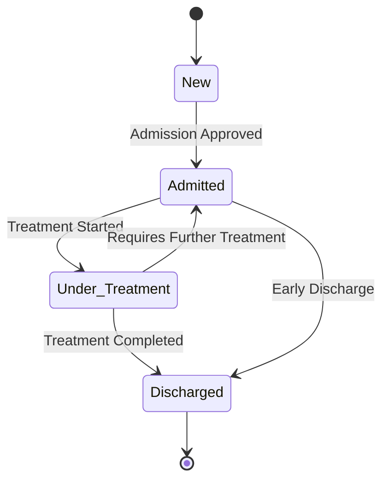
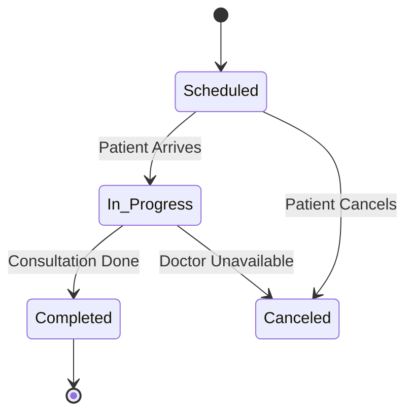
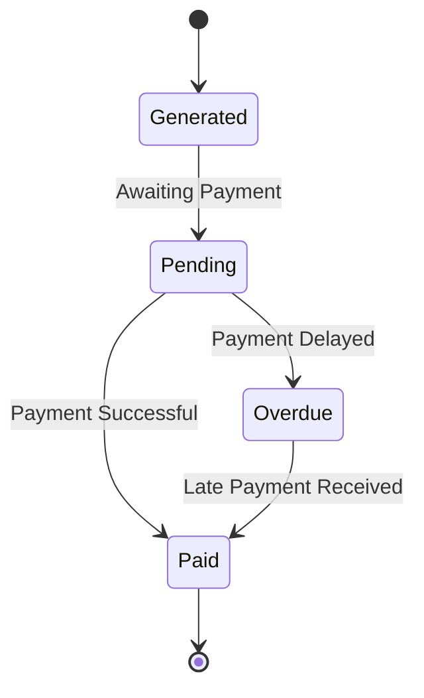
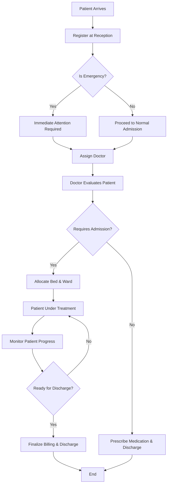
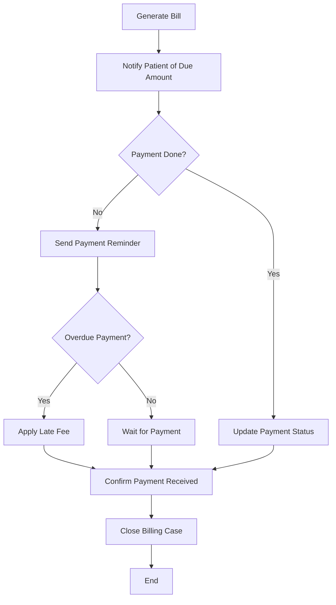
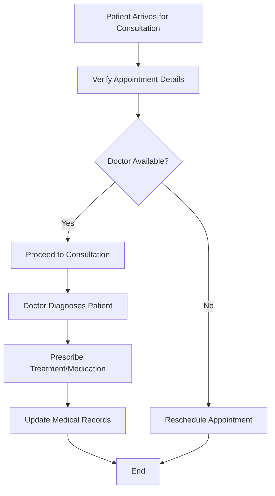

# Assessment 8: Hospital Management System (HMS)

## **1. Introduction**
The Hospital Management System (HMS) is a software application designed to manage the day-to-day operations of a hospital. The system enables the effective and efficient management of hospital administrative tasks, patient care processes, appointment scheduling, billing, and reporting. This assessment provides UML diagrams, including state transition diagrams and activity diagrams, that demonstrate the dynamic behavior and workflows of the HMS.

---

## **2. State Transition Diagrams**
State transition diagrams show the life cycle of objects within the system. Below are the state transitions for patients, appointments, and billing processes.

### **2.1 Patient State Transition Diagram**

### **2.2 Appointment State Transition Diagram**

### **2.3 Billing State Transition Diagram**

---

## **3. Activity Diagrams**
Activity diagrams represent workflows of stepwise activities and actions. Below are key activity diagrams for the HMS.

### **3.1 Patient Admission Workflow**

### **3.2 Billing & Payment Workflow**

### **3.3 Doctor Consultation Workflow**

---

## **4. Conclusion**
This assessment presented essential UML diagrams to depict the dynamic behavior of the Hospital Management System. The state transition and activity diagrams help visualize the system's process flows including patient handling, appointment scheduling, billing, and consultation. These models provide a clear understanding of system functionalities and can guide further system development and refinement.

---

**End of Assessment 8**
