# Assessment 8: Hospital Management System (HMS)

## **1. Introduction**
The Hospital Management System (HMS) is a software application designed to manage the day-to-day operations of a hospital. The system enables the effective and efficient management of hospital administrative tasks, patient care processes, appointment scheduling, billing, and reporting. This assessment provides UML diagrams, including state transition diagrams and activity diagrams, that demonstrate the dynamic behavior and workflows of the HMS.

---

## **2. State Transition Diagrams**
State transition diagrams show the life cycle of objects within the system. Below are the state transitions for patients, appointments, and billing processes.

### **2.1 Patient State Transition Diagram**
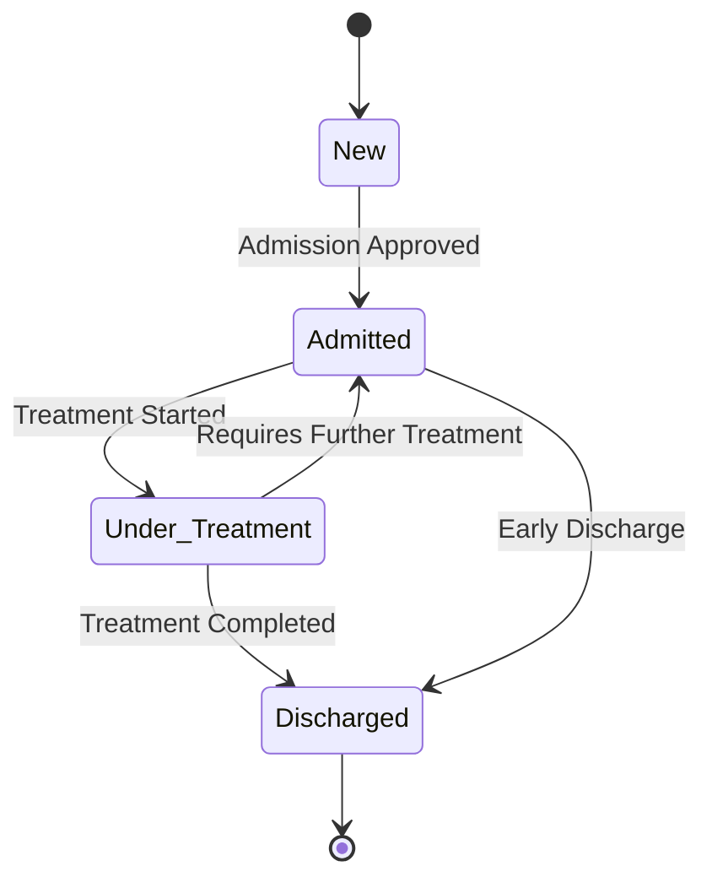

### **2.2 Appointment State Transition Diagram**
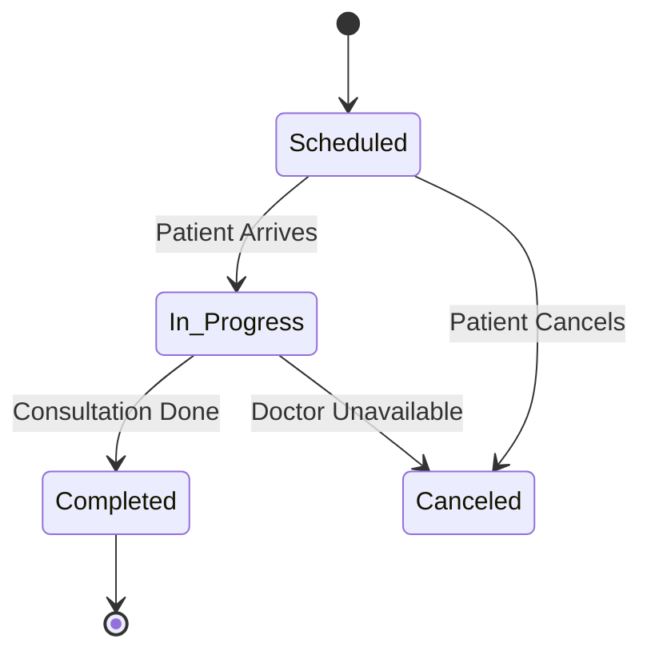

### **2.3 Billing State Transition Diagram**
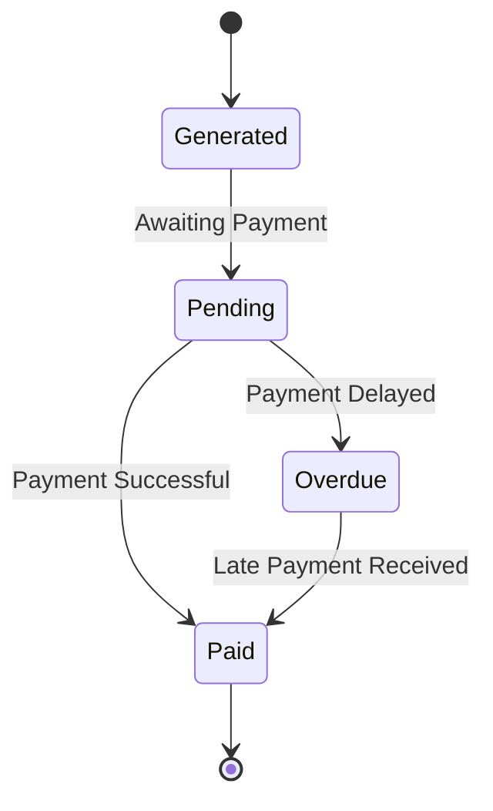
### **2.4 User Account State Transition Diagram**
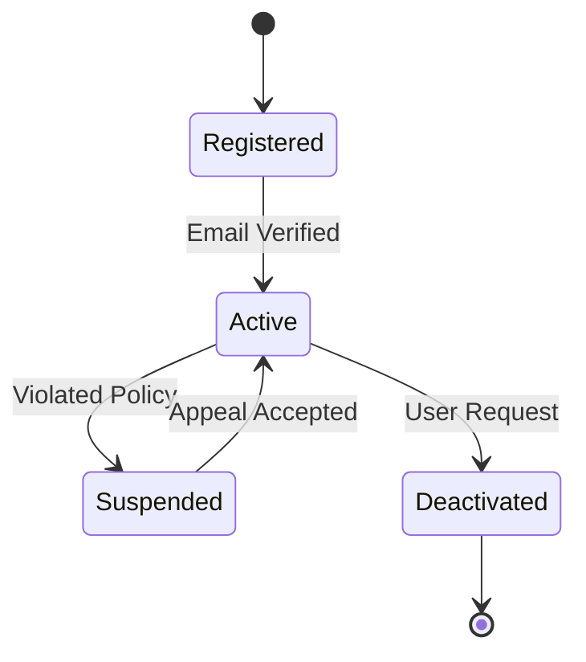
### **2.5 Medical Record State Transition Diagram**
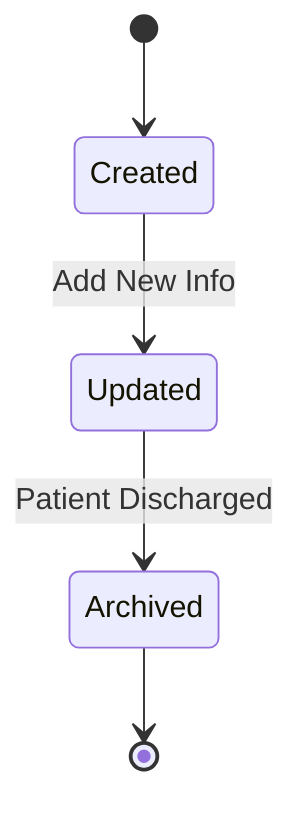
### **2.6 Prescription State Transition Diagram**
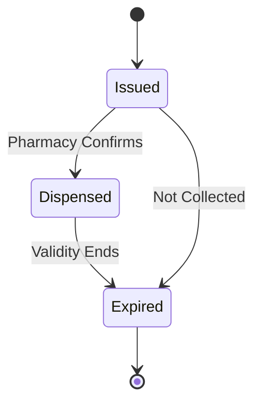
### **2.7 Staff Schedule State Transition Diagram**
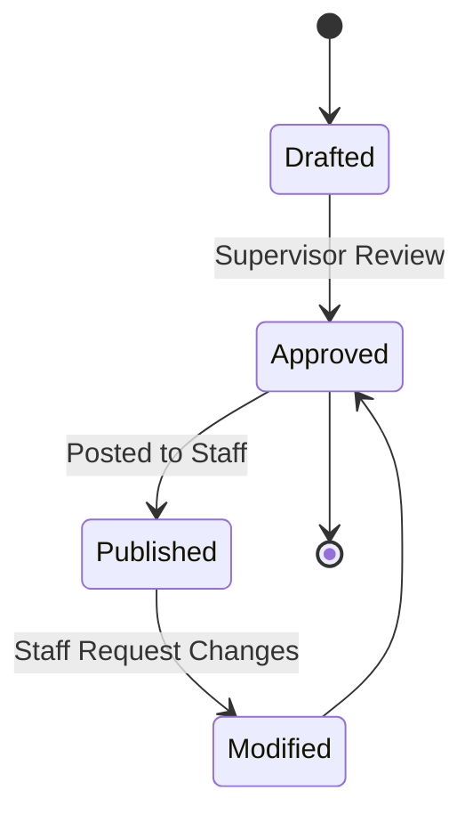

---

## **3. Activity Diagrams**
Activity diagrams represent workflows of stepwise activities and actions. Below are key activity diagrams for the HMS.

### **3.1 Patient Admission Workflow**
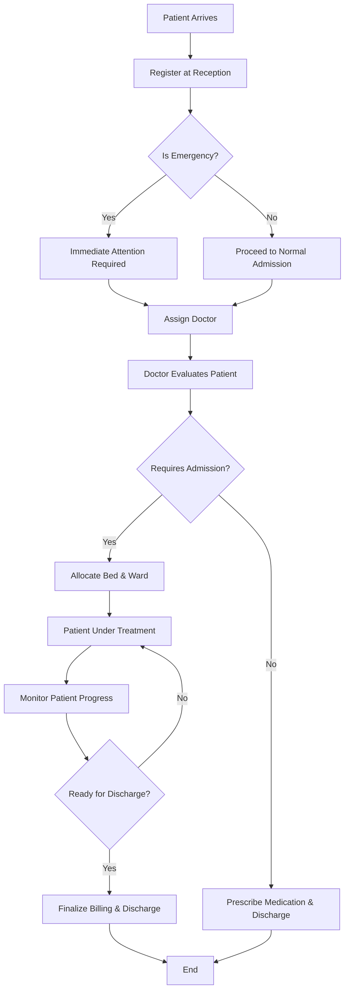

### **3.2 Billing & Payment Workflow**
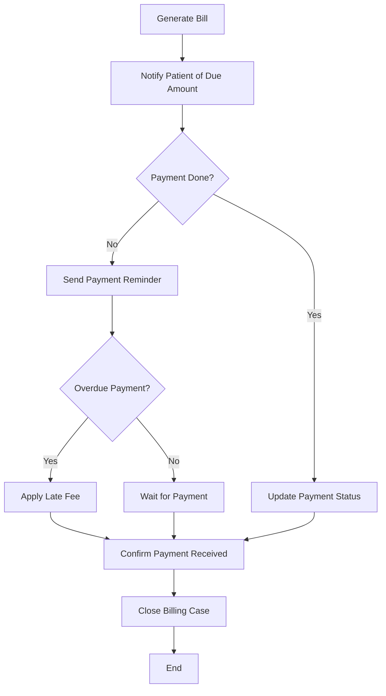

### **3.3 Doctor Consultation Workflow**
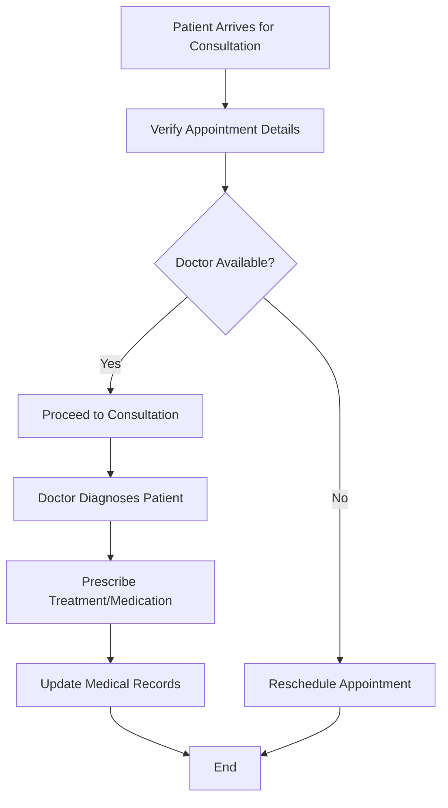
### **3.4 User Registration Workflow**
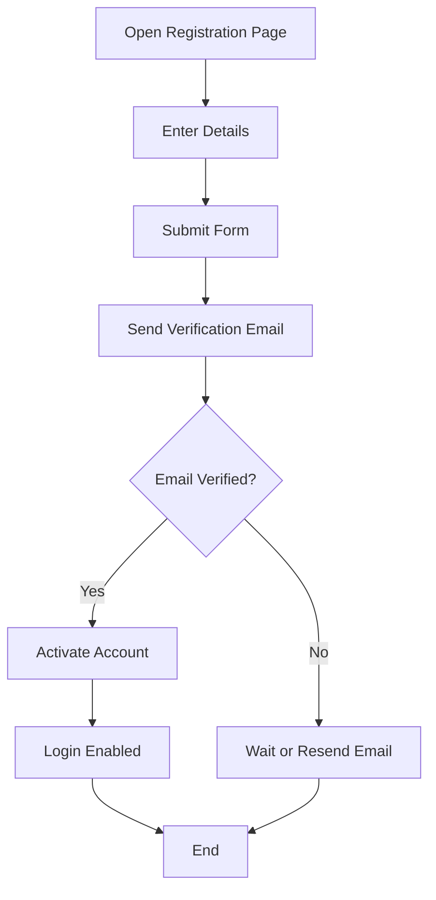
### **3.5 Discharge Process Workflow**
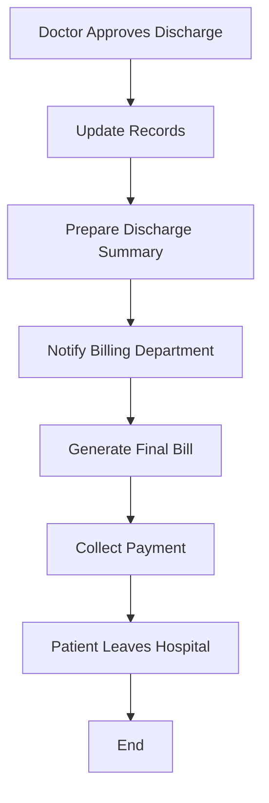
### **3.6 Generate Medical Report Workflow**
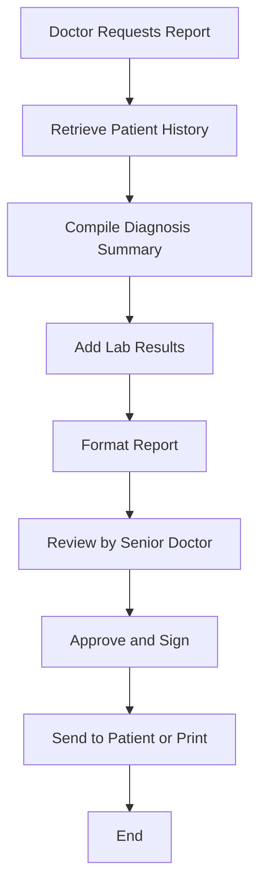
### **3.7 Book Appointment Workflow**
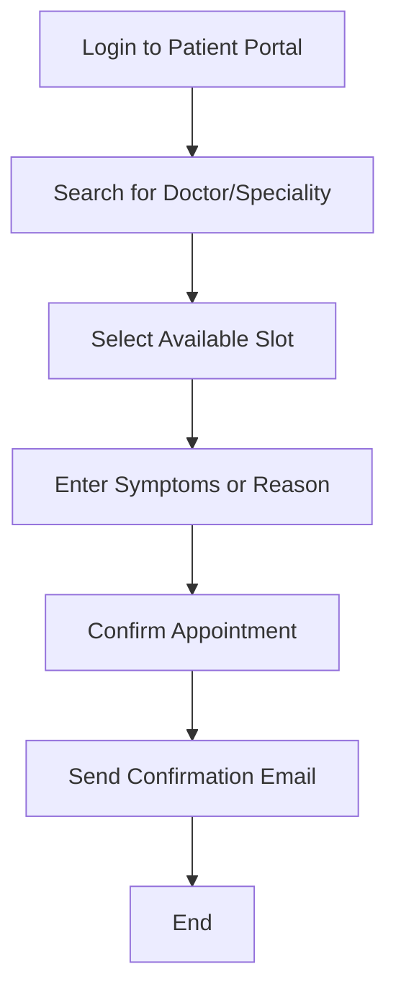
### **3.8 Patient Feedback Workflow**
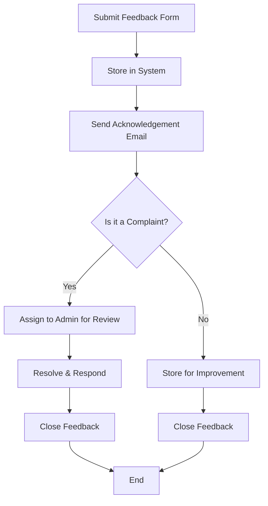

---
## **4. Reflecion**
# Reflection on Hospital Management System UML Models

## Granularity Decisions
In designing the state transition and activity diagrams, I focused on balancing simplicity with enough detail to reflect real-world processes. For example, while the `Patient` state transition could include intermediate stages like “Transferred,” I chose to focus on key lifecycle states to avoid overwhelming complexity.

## Agile Process Alignment
Linking user stories and functional requirements from previous assignments helped ensure the diagrams were aligned with user expectations. Activity diagrams naturally supported these stories by showing step-by-step interactions (e.g., booking an appointment or generating a medical report).

## Comparison of Diagrams
- **State diagrams** excel at visualizing the life cycle of individual entities like `Prescription` or `Billing`, especially in systems with conditional paths.
- **Activity diagrams** were better for illustrating workflows involving multiple roles and steps, such as the discharge process or feedback handling.

## Lessons Learned
Creating these diagrams improved my understanding of dynamic system modeling. It also showed how visual tools can communicate complex workflows clearly, which is valuable for both developers and stakeholders in Agile teams.

## **5. Conclusion**
This assessment presented essential UML diagrams to depict the dynamic behavior of the Hospital Management System. The state transition and activity diagrams help visualize the system's process flows including patient handling, appointment scheduling, billing, and consultation. These models provide a clear understanding of system functionalities and can guide further system development and refinement.

---

