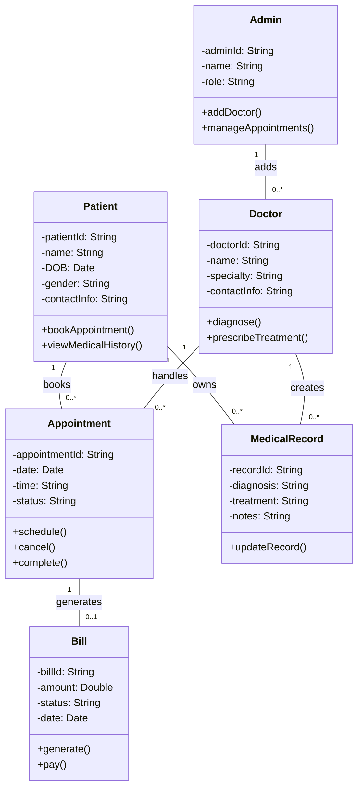

## **1. Domain Model**

| Entity      | Attributes                                   | Methods                                 | Relationships                                           |
|-------------|----------------------------------------------|-----------------------------------------|---------------------------------------------------------|
| Patient     | patientId, name, DOB, gender, contactInfo    | bookAppointment(), viewMedicalHistory() | Visits Doctor, Has MedicalRecord(s), Pays Bill         |
| Doctor      | doctorId, name, specialty, contactInfo       | diagnose(), prescribeTreatment()        | Manages Appointment(s), Linked to Patient via Visits    |
| Appointment | appointmentId, date, time, status            | schedule(), cancel(), complete()        | Links Patient and Doctor                                |
| MedicalRecord | recordId, diagnosis, treatment, notes     | updateRecord()                          | Belongs to Patient, Created by Doctor                   |
| Bill        | billId, amount, status, date                 | generate(), pay()                       | Associated with Patient and Appointment                 |
| Admin       | adminId, name, role                          | addDoctor(), manageAppointments()       | Manages System Data                                     |

### **Business Rules**

- A patient can have multiple appointments, but only one appointment per doctor at a time.
- A doctor can have many appointments per day.
- Bills must be paid before a new appointment is scheduled.
- Each patient has one or more medical records.
- Only Admin can add new doctors to the system.

---

## **2. Mermaid.js Class Diagram**

---

## **3. Reflection **

> **Challenges:**
While designing the domain model, I found it challenging to balance abstraction with specificity. Identifying the appropriate responsibilities for each class (e.g., should the Doctor generate a bill or should that be part of Appointment?) required careful thought. Modeling relationships with correct multiplicities also posed a challenge, especially in representing the many-to-many interactions like Patients and Doctors via Appointments.

> **Alignment with Prior Work:**
This model reflects the requirements and use cases developed in previous assignments. For instance, the `bookAppointment()` and `diagnose()` methods directly stem from use cases like “Book a Doctor Visit” and “Consultation”. Behavioral models such as state diagrams influenced method development (e.g., Appointment has a state progression from scheduled to completed or canceled).

> **Trade-offs Made:**
To keep the model manageable, I avoided sub-classes like “Inpatient” and “Outpatient”, although they could be introduced using inheritance. I also used direct associations where aggregation might have added complexity. Keeping the Bill entity separate from Appointment allowed clearer financial tracking but required additional relationships.

> **Lessons Learned:**
This assignment taught me the value of clarity and simplicity in design. Object-oriented modeling is not just about replicating real-world objects, but about capturing useful abstractions that align with business logic. I now better understand how domain modeling lays the groundwork for later phases of development.

---

