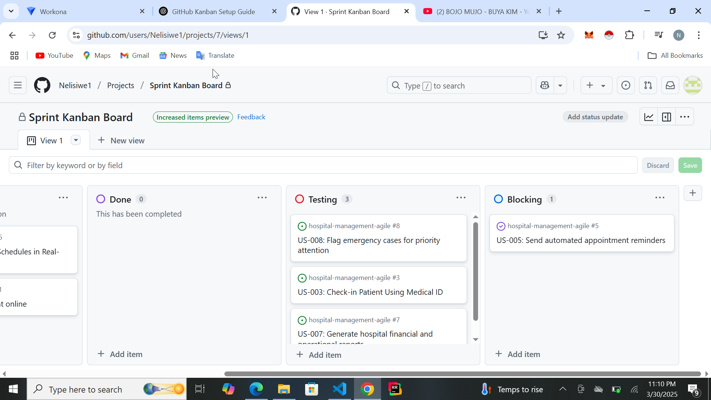
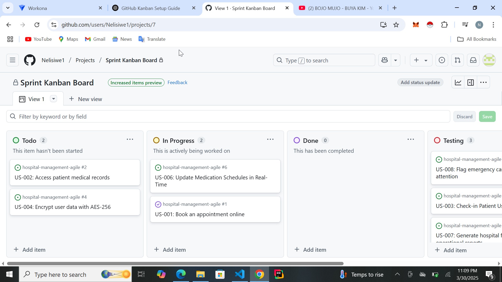

# 🏗️ GitHub Kanban Board Project  

## 📌 Overview  
This project implements a **Kanban board** using GitHub Projects to manage tasks efficiently in an Agile workflow. It is based on **Assignment 6**, where we developed user stories and sprint planning.  

## 🎯 Objectives  
- Analyze GitHub project templates and select the best fit.  
- Customize a **Kanban board** with additional workflow stages.  
- Link **GitHub Issues** (user stories) and assign tasks to team members.  

---

## 📊 Kanban Board Setup  

### ✅ **1. Chosen Template: Automated Kanban**  
We selected **Automated Kanban** because:  
✔️ It supports **sprint tracking** with built-in automation.  
✔️ Tasks automatically move as their status changes.  
✔️ It aligns well with **Agile principles** like continuous iteration.  

### 🛠️ **2. Customizations**  
We made the following modifications:  
🔹 **Added "Testing" Column** – for tracking QA progress.  
🔹 **Added "Blocked" Column** – to highlight stalled tasks.  
🔹 **Linked GitHub Issues** – to keep track of user stories.  
🔹 **Assigned Tasks** – using `@mentions` for clear responsibility.  

---

## 🏗️ **Project Workflow**  
The board follows this workflow:  
1️⃣ **To Do** → Backlogged tasks ready to be worked on.  
2️⃣ **In Progress** → Tasks currently being developed.  
3️⃣ **Testing** → Tasks undergoing validation and review.  
4️⃣ **Blocked** → Tasks that need external dependencies.  
5️⃣ **Done** → Successfully completed and merged tasks.  

🛑 **Work-in-Progress (WIP) Limit**: No more than **3 active tasks** per column to avoid bottlenecks.  

---

## 🔗 **Kanban Board & Issues**  
📌 [View the Kanban Board](https://github.com/users/Nelisiwe1/projects/7/views/1)  
  

---

## 📸 **Screenshots**  
🚀 Screenshot of the **Kanban Board**  
  

🚀 Screenshot of a **Linked Issue**  
  

---

## 📖 **Reflection & Challenges**  
- Choosing the **best template** required comparing automation features.  
- **Customizing columns** helped refine the Agile workflow.  
- Compared **GitHub Projects vs Trello vs Jira** for project tracking.  

### 🏁 **Conclusion**  
This Kanban board successfully manages the Agile workflow and tracks sprint progress efficiently. The automation features help streamline task movement and improve team productivity.  

 
